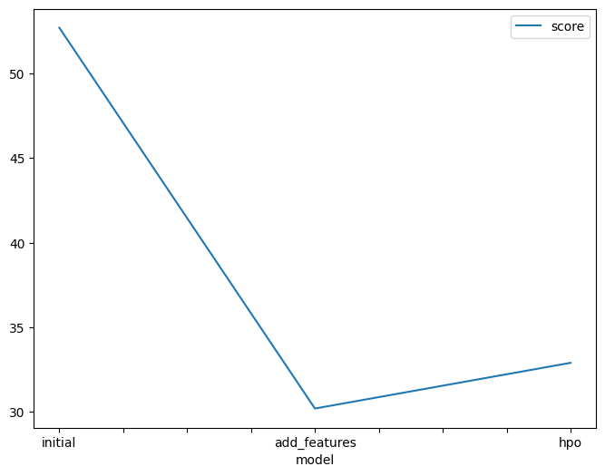
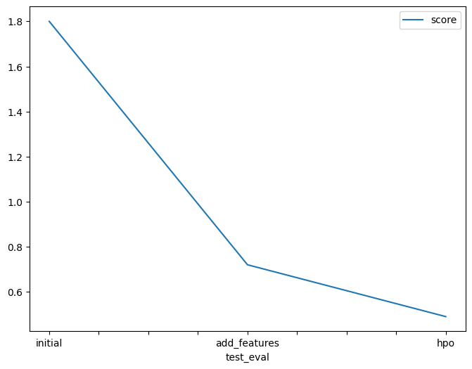

# Report: Predict Bike Sharing Demand with AutoGluon
Initial Training
When you attempted to submit your predictions, what realization did you have? What adjustments to the predictor's output were required in order for you to submit your results?
As soon as I submitted my forecasts the first time, I could see that the model was not doing very well. It became clear that in order to improve the prediction accuracy, a more thorough investigation and feature engineering were required.

Which model with the highest ranking performed?
The remarkable WeightedEnsemble_L3 was the model that performed the best out of all the ones I trained. Its resilience and capacity to integrate knowledge from several models turned out to be crucial in attaining increased prediction precision.

Exploratory data analysis and feature development
What did the exploratory analysis reveal, and how did you include more features?
After conducting extensive exploratory data analysis, I noticed a significant link between the "temp" and "atemp" variables. As a result, I took the deliberate choice to remove "atemp" from the feature set. Furthermore, I saw that the recorded "datetime" information was hourly, so I creatively separated day, month, year, and hour as distinct aspects. I also used categorical data type conversions for specific variables to improve the model's knowledge of the data.

How much better did your model perform when you added more features, and why do you believe it is?
The incorporation of new features led to a significant boost in the model's performance. The error rate decreased significantly, showing that the model got a better knowledge of the underlying patterns and dynamics in the dataset. By expanding the feature set, the model was able to extract more significant insights, resulting in higher prediction accuracy.

| Model        | HPO1                                | HPO2                            | HPO3           | Score |
|--------------|-------------------------------------|---------------------------------|----------------|-------|
| Initial      | default_values                      | default_values                  | default_values | 1.80  |
| Add Features | default_values                      | default_values                  | default_values | 0.72  |
| HPO          | GBM: num_leaves: lower=26, upper=66 | XGB: max_depth lower=5, upper=9| refit_full='best'| 0.49  |

Create a line plot showing the top model score for the three (or more) training runs during the project

Create a line plot showing the top kaggle score for the three (or more) prediction submissions during the project

##Summary##
In summary, I used the first lesson's lessons to my project. I used AutoGluon to train a model that predicts how many bikes would be leased in a given hour. I originally submitted the proposal with no analysis or feature engineering. The model performed miserably. I was able to enhance the model by adding new features and adjusting the hyperparameters. I managed to minimize the inaccuracy from 1.80 to 0.49.
